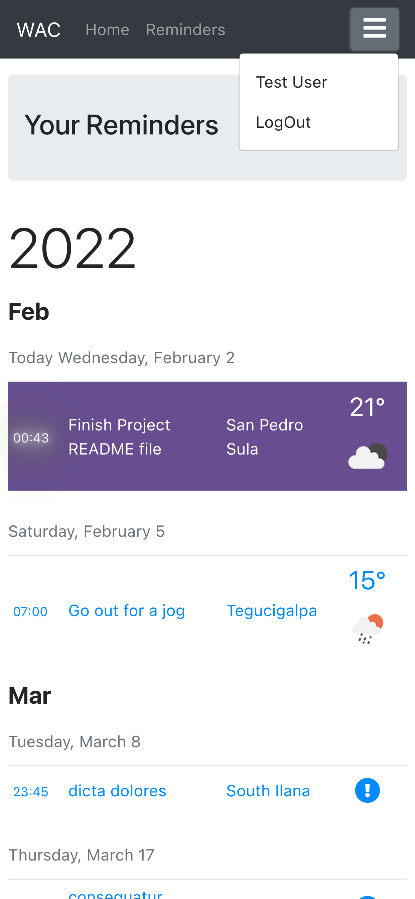

<div align="center">
<h1>Weather App Calendar API</h1>
</div>

<div align="center">
    
     
    
    
    
    
    
    
    
</div>

<br>

<p align="center">This RESTFUL API works as the backend for a React web app. I host the API in Render through a <i>dockerized Ruby on Rails</i> app. Authentication is handled with a JWT Token stored in the localStorage of the frontend.</p>

<br>

<div align="center">



</div>

<br>

## About
Weather App Calendar API is the API handling the core requests of the Weather Calendar App. The frontend is a ***fully responsive*** react web app deployed [here](https://weather-app-calendar.netlify.app/). The [repo for the front-end is here](https://github.com/StarSheriff2/Weather-App-Calendar---frontend). I built request tests for all endpoints. I also created tests for all models. I use JWT token to handle user authentication and authorization.

### File Structure
<div align="left">
</div>
<div align="left">
</div>

### Features:
- authenticate user
- create new user
- create new session
- all CRUD operations for the Reminder resource

### Front-end React app
- The front-end associated with this app is [here](https://weather-app-calendar.netlify.app).

- The Github repo of the front-end is [here](https://github.com/StarSheriff2/Weather-App-Calendar---frontend).

### Live Demo


Deployed to Render.com

### Built With
- Ruby 3.0.2p107 (2021-07-07 revision 0db68f0233) [arm64-darwin20]
- Rails 6.1.4.4
- PostgreSQL 14
- Rspec (testing)
- Faker gem
- Factory bot
- JWT
- Docker

## Getting Started

To get a local copy up and running, follow these simple example steps.

#### Get files
1. Open your terminal or command prompt.
2. If you do not have git installed in your system, skip this step and go to step 3; otherwise, go to the directory where you want to copy the project files and clone it by copying this text into your command prompt/terminal:
```
  https://github.com/StarSheriff2/Weather-App-Calendar---backend.git
```
<br>Now go to the ***"Install Dependencies"*** section.

3. Download the program files by clicking on the green button that says “**Code**” on the upper right side of the project frame.
4. You will see a dropdown menu. Click on “**Download ZIP**.”
5. Go to the directory where you downloaded the **ZIP file** and open it. Extract its contents to any directory you want in your system.

### Docker Deploy

#### Prerequisites

- Docker 20.10.22 or latest
- Docker Compose v2.15.1

#### Run

```bash
  docker compose up -d
```

### Local deploy
#### Prerequisites

- Ruby 3.0.2p107
- Rails 6.1.4.4
- PostgreSQL 14

#### Install Dependencies
1. If you are not in your system terminal/command prompt already, please open it and go to the directory where you cloned the remote repository or extracted the project files.
2. While in the project root directory, type
    ```
    bundle install
    ```
This command will install all the necessary gems in your system.

#### Database Setup

- In your terminal, type <code>bin/rails db:setup</code> to create your local databases, load the schema, and initialize with the seed data.

You are all set now!
## Usage

1. In your terminal, run <code>bin/rails server</code> while inside the root directory of the repository files
2. The app allows API calls using curl or your favorite API client, such as Postman, HTTPPie or VS Code's Thunder Client. Here's a link to [HTTPIE](https://httpie.io).
3. Check status of the api by calling [http://localhost:3001/healthcheck](http://localhost:3001/healthcheck)

**Note:<br>_These command will not stop on its own. To exit, hit "ctrl + c"_**

## Development
### Testing
- Unit / Model tests
- ***Integration tests (coming soon)***
- API request tests

To run all tests, type this into command line:
```
 bundle exec rspec
```

### Linters
To run ***Rubocop***, go to the root directory of your repository and copy/paste the following command into your terminal:
```
 rubocop .
```

## Authors
👤 **Arturo Alvarez**
- Github: [@StarSheriff2](https://github.com/StarSheriff2)
- Twitter: [@ArturoAlvarezV](https://twitter.com/ArturoAlvarezV)
- Linkedin: [Arturo Alvarez](https://www.linkedin.com/in/arturoalvarezv/)

## 🤝 Contributing

Contributions, issues, and feature requests are welcome!

Feel free to check the [issues page](https://github.com/StarSheriff2/Weather-App-Calendar---backend/issues).

## 🤝 Acknowledgements

JWT Implementation:
 - Heavy reliance on [this tutorial series to develop this JWT authentication strategy](https://www.digitalocean.com/community/tutorials/build-a-restful-json-api-with-rails-5-part-one).

## Show your support

Give a ⭐️ if you like this project!

## 📝 License

This project is [MIT](https://github.com/StarSheriff2/Weather-App-Calendar---backend/blob/main/LICENSE) licensed.
